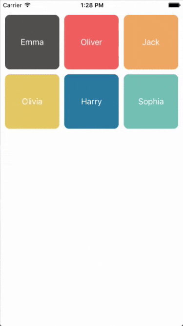

## RSKCollectionViewRetractableFirstItemLayout   

  

A light-weight UICollectionViewFlowLayout subclass that allows the first item to be retractable.

## Installation
*RSKCollectionViewRetractableFirstItemLayout requires iOS 7.0 or later.*

### iOS 7

1.  Drag the code itself (.swift files) to your project. As sadly, Swift currently does not support compiling Frameworks for iOS 7.
2.  Make sure that the files are added to the Target membership.

### Using [CocoaPods](http://cocoapods.org)

1.  Add the pod `RSKCollectionViewRetractableFirstItemLayout` to your [Podfile](http://guides.cocoapods.org/using/the-podfile.html).

        pod 'RSKCollectionViewRetractableFirstItemLayout'

2.  Run `pod install` from Terminal, then open your app's `.xcworkspace` file to launch Xcode.

### Using [Carthage](https://github.com/Carthage/Carthage)

1.  Add the `ruslanskorb/RSKCollectionViewRetractableFirstItemLayout` project to your [Cartfile](https://github.com/Carthage/Carthage/blob/master/Documentation/Artifacts.md#cartfile).

        github "ruslanskorb/RSKCollectionViewRetractableFirstItemLayout"

2.  Run `carthage update`, then follow the [additional steps required](https://github.com/Carthage/Carthage#adding-frameworks-to-an-application) to add the iOS and/or Mac frameworks into your project.

## Demo

Build and run the `RSKCollectionViewRetractableFirstItemLayoutExample` project in Xcode to see `RSKCollectionViewRetractableFirstItemLayout` in action.
Have fun. Figure out hooks for customization.

## Contact

Ruslan Skorb

- http://github.com/ruslanskorb
- http://twitter.com/ruslanskorb
- ruslan.skorb@gmail.com

## License

This project is available under the Apache License, version 2.0. See the LICENSE file for more info.
